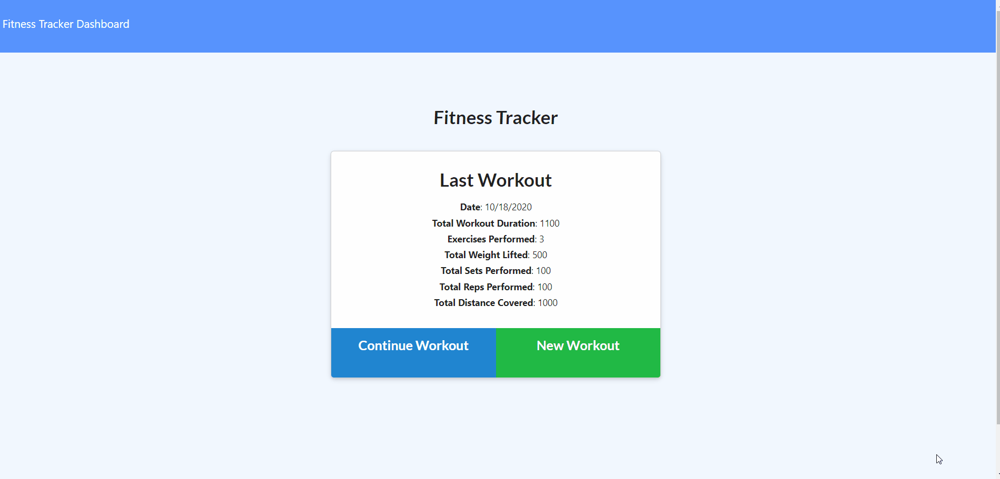

# 17FitnessTracker

Heroku Deplyed Link: https://vinces-fitness-tracker.herokuapp.com/



## Description 
An app that keeps track of eexercises
 
# Table of Contents 
- [Installation](#installation) 
- [Usage](#usage) 
- [Contribution](#contribution) 
- [Tests](#tests) 
- [License](#license) 
- [Questions](#questions) 

## Installation 
To install, run the following command:
```
npm i
```

## Usage
Run the command:
```
npm start
```

## License 
This application is covered by: NPM Package
 
## Contribution 
See questions
 
## Tests

Run the following command to add initial information to the database:

```
npm test
```
 
## Questions 
If you have any questions feel free to contact: 
 
[GitHub](https://github.com/vmcgargill) 
 
Email: [vincentmcgargill@gmail.com](mailto:vincentmcgargill@gmail.com)